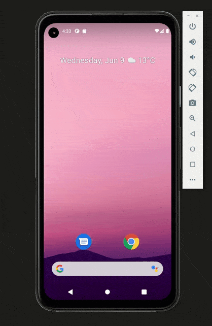

# WBOOK

React Native App.



* Ubicarnos sobre el directorio del proyecto

```
>> cd wolox
```
* instalar las dependencias
```
>> yarn add
```
* correr el proyecto

```
>> npx react-native start &&  npx react-native run-android
```

* ejecutar el servidor 
```
>> json-server --watch ./assets/db.json
```